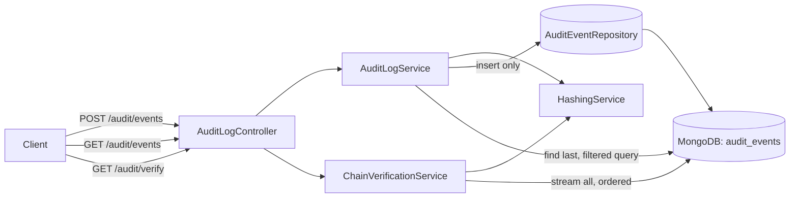

# Architecture Overview

## 1. Problem framing

The core requirement is trust, not just storage: once a record is written, any change to
it — including deletion — must become detectable, without relying on anyone's promise not
to touch the database directly. That reframes the problem from "build a CRUD API" (with
delete/update simply omitted) to "build a data structure where tampering is
mathematically visible," because an admin with direct database access can always bypass
API-level guardrails. A hash chain is the standard answer to that: each record commits to
its own content and to the record before it, so changing anything anywhere breaks a
verifiable, recomputable relationship.

## 2. Component diagram

- **`AuditLogController`** — HTTP boundary. Note there is no update/delete route defined
  anywhere in this class.
- **`AuditLogService`** — owns the append invariant (sequencing + chain linkage) and the
  filtered query logic.
- **`ChainVerificationService`** — read-only; independently re-derives every hash from
  stored fields and reports where the chain diverges from what it should be.
- **`HashingService`** — pure functions only (no I/O, no Spring context dependency beyond
  `@Service` for injection). Deliberately isolated so the hashing scheme itself — the part
  a reviewer will want to interrogate most closely — is trivial to read and unit test in
  full isolation from Mongo.

## 3. Data model

Collection `audit_events`, one document per event:

| Field | Type | Notes |
|---|---|---|
| `sequenceNumber` | long | 1-based, unique-indexed. Defines chain order. |
| `eventType`, `actorId`, `resourceType`, `resourceId` | string | Required, indexed (compound indexes for the query patterns in the spec). |
| `payload` | object | Arbitrary event-specific detail. Canonicalized (recursive key-sort) before hashing so key order never affects the hash. |
| `timestamp` | Instant | Server-assigned, truncated to millisecond precision; see "Timestamp handling" below. |
| `clientSuppliedEventTime` | Instant, optional | Caller's own view of event time; stored and hash-covered, never authoritative for ordering. |
| `contentHash` | string (hex SHA-256) | Hash of this record's own fields. |
| `previousHash` | string (hex SHA-256) | The previous record's `chainHash`, or the configured genesis value for record #1. |
| `chainHash` | string (hex SHA-256) | `sha256(contentHash + previousHash)`. This is what the *next* record links to. |

### Why two hashes (`contentHash` and `chainHash`) instead of one

The spec asks for both "a hash of its own content" and "a hash of the preceding record."
Collapsing these into a single field would conflate two different questions during
verification: *did this record's own data change?* vs *was this record disconnected from
its rightful place in the sequence?* Keeping them separate lets `GET /audit/verify` report
a precise violation type instead of a generic "hash mismatch" — which matters a lot when
someone actually has to investigate a break.

### Timestamp handling (explicit design choice, and a bug we hit)

`timestamp` is **server-assigned** at the moment of persistence, not caller-supplied. A
caller-supplied timestamp would be trivial to spoof (backdate or postdate an event), which
directly undermines an audit log whose entire purpose is being trustworthy. Callers may
still attach their own view of event time via `clientSuppliedEventTime` — it's preserved
and hash-covered for context — but it never drives ordering or the authoritative
`timestamp` used in time-range queries.

**Bug found during manual testing:** the first implementation used `Instant.now()`
directly, which carries microsecond/nanosecond precision. MongoDB's BSON `Date` type only
stores millisecond precision, so the value written to the hash at append time did not
match the value `ChainVerificationService` read back and rehashed at verify time —
producing false-positive `CONTENT_HASH_MISMATCH` results on records that were never
touched. Fixed by truncating to `ChronoUnit.MILLIS` before hashing, so the hashed value
always matches what MongoDB will actually persist and return. This is the concrete lesson
behind a general rule followed throughout this codebase: **hash the value in the exact
form it will be persisted and re-read, not the richest in-memory representation available
before storage.**

## 4. Concurrency & scaling (the honest trade-off)

Two invariants must hold on every append: no two records share a `sequenceNumber`, and
every record's `previousHash` is exactly the prior record's `chainHash`. Both require
reading "what is currently the last record" before writing the next one — a
read-then-write that is not atomic in MongoDB across two separate operations.

This prototype serializes all appends through a single in-process `ReentrantLock`
(`AuditLogService.appendLock`), which is correct and sufficient for **one running
instance** — the deployment target for this exercise. On top of that, `sequenceNumber`
carries a unique index as a hard backstop: if a second writer ever raced past the lock
(e.g. someone scaled this out to two instances against the same database before fixing
the write path), the loser's insert fails fast with a duplicate-key error instead of
silently producing a corrupted chain. Fail loud beats silently wrong for an audit trail.

**What horizontal scaling would actually require** (explicitly out of scope for this
prototype, called out rather than silently ignored):
1. A single designated writer per chain/partition (e.g. shard by `resourceType`, each
   shard owned by one writer), or
2. Moving the append into a MongoDB transaction with optimistic retry keyed off an
   expected `previousHash` (compare-and-swap semantics), or
3. Fronting all writes with a durable, ordered log (e.g. Kafka) and having exactly one
   consumer perform the chain append — the strongest option, since it also gives you a
   natural replay/rebuild path if the Mongo collection ever needs to be reconstructed.

## 5. Verification design

`GET /audit/verify` streams the entire collection ordered by `sequenceNumber` (via a
Mongo cursor, so memory use doesn't grow with collection size) and, for every record,
independently recomputes:
- its `contentHash` from the stored fields → catches **content tampering**
- its `chainHash` from its own `contentHash` + `previousHash` → catches a **directly
  edited hash field**
- that its `previousHash` equals the prior record's `chainHash` → catches **reordering,
  relinking, or a deleted record whose neighbors were patched to hide the gap**
- that `sequenceNumber` has no gaps → catches an **outright deleted record**

All findings are collected (not just the first), but `firstViolation` is called out
specifically, since everything chained after the first break is a near-certain cascading
effect of it and not an independent finding.

This is deliberately O(n) per call — the right complexity for a prototype and for
verifying "did anything change since the last audit," but not for calling it on every
page load of a large log. The natural next step for scale is checkpointing: periodically
record a trusted `(sequenceNumber, chainHash)` pair out-of-band, and let `/audit/verify`
accept a `since` checkpoint to verify incrementally instead of from record 1 every time.
Not implemented here to keep the core mechanism easy to read and defend.

## 6. Extending toward Scenario B (not implemented, but designed for)

The two hard problems in Scenario B are (a) archiving without producing a false-positive
break, and (b) redacting a field without invalidating `contentHash`.

- **Archival**: because `chainHash` for record N only depends on record N's own
  `contentHash` and `previousHash` — not on record N actually still being queryable — an
  archived record can be moved to cold storage and `/audit/verify` can still succeed *if*
  it treats "record present in cold storage with a hash matching what the live chain
  expects at that sequence number" as equivalent to "record present." That means
  verification needs a pluggable record source (live collection + archive) rather than a
  single collection scan, which is why `ChainVerificationService` is already structured
  as a service independent of `AuditEventRepository`, working purely off an ordered stream
  of records.
- **Redaction**: the real fix is to never hash the raw field in the first place for
  fields flagged as potentially sensitive — hash a per-field commitment (e.g. a salted
  hash of each payload field, or a Merkle tree over payload fields) instead of the literal
  value. Redaction then means replacing the field's *value* with a tombstone while keeping
  its *commitment*, which still verifies, at the cost of not being able to prove what the
  original value equalled without an off-band disclosure of the salt. This is a
  meaningfully different hashing scheme from Scenario A's and was intentionally not
  half-implemented here.

## 7. Security notes (called out, not implemented)

- No authentication/authorization is implemented. At minimum, a production version needs
  to authenticate the caller of `POST /audit/events` and derive `actorId` from that
  identity server-side rather than trusting a client-supplied field.
- `GET /audit/verify` and `GET /audit/events` are read endpoints that could leak
  sensitive payload contents to anyone who can reach the service; a real deployment needs
  authorization scoping on queries.
- MongoDB connection string / credentials are read from environment (`MONGODB_URI`), not
  hardcoded, so real credentials never need to enter source control.

## 8. Risks & failure scenarios considered

| Risk | Mitigation / status |
|---|---|
| Two concurrent writers corrupt sequencing | In-process lock + unique index backstop (see §4); real horizontal scaling needs one of the three options in §4. |
| Clock skew across restarts affects `timestamp` ordering | `sequenceNumber`, not `timestamp`, is the authoritative order for chain purposes; `timestamp` is informational/queryable only. |
| Hashing a value at a different precision than what's actually persisted | Hit this in practice with `Instant.now()` vs. MongoDB's millisecond-precision `Date` (see §3); fixed by truncating before hashing. |
| Someone edits the DB directly and also "fixes" the hash fields to match | Impossible to do consistently past the edited record without recomputing every subsequent `chainHash`. Demonstrated in `ChainVerificationServiceTest`. |
| Large collection makes `/audit/verify` slow | Streamed cursor keeps memory bounded; checkpointing (§5) is the identified path if latency becomes a problem. |
| Genesis record's `previousHash` is itself forged | Verification explicitly checks record #1's `previousHash` against the configured genesis constant (`ViolationType.INVALID_GENESIS`). |

## 9. Known limitation: integration test disabled on this dev machine

`AuditLogIntegrationTest` (Testcontainers-based, spins up a real MongoDB in Docker and
drives the full write → verify → tamper → verify flow through real HTTP calls) is present
in the codebase but marked `@Disabled`. On this development machine, Testcontainers'
bundled Docker client fails to negotiate with Docker Desktop 29.6.2 — every connection
strategy receives a 400 response with an empty body from the daemon's version endpoint.
`docker ps` / `docker info` via Docker's own CLI work correctly, confirming this is a
compatibility gap between the third-party `docker-java` library and a very recent Docker
Desktop release, not an issue in this codebase.

The exact scenario this test automates has been independently confirmed three other ways:
manually via curl, manually via Postman (see `postman/`), and via
`ChainVerificationServiceTest`'s tamper/deletion/relink scenarios run against realistic
in-memory data. On a machine with a compatible Docker version, removing `@Disabled` should
make the test pass without further changes.